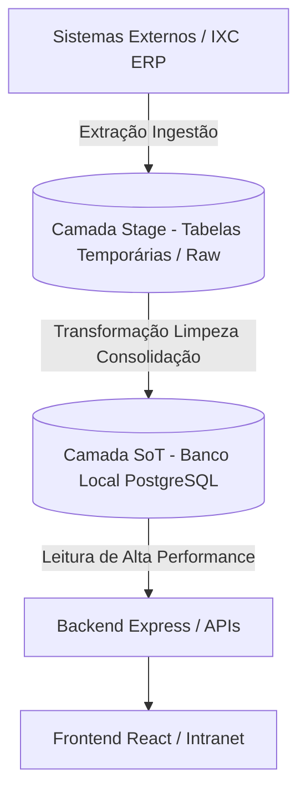
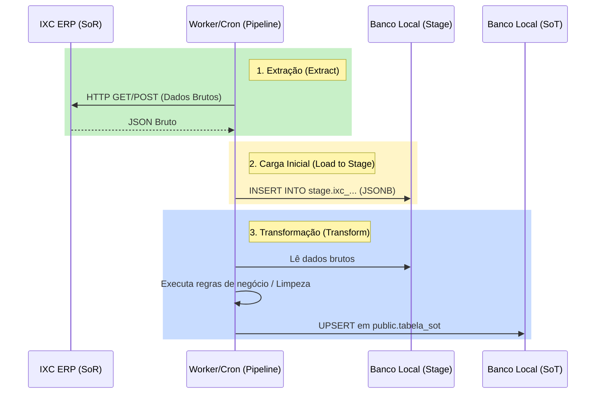

# Arquitetura de Dados: Stage, SoR e SoT para Prestek Intranet

Este documento descreve o modelo conceitual e estrutural para a futura implementação de um pipeline de dados baseado em camadas (**Stage**, **System of Record - SoR** e **Source of Truth - SoT**) no ecossistema da Prestek Intranet.

---

## 1. Visão Geral dos Conceitos

No contexto de engenharia e integração de dados, dividimos o ciclo de vida dos dados em três camadas fundamentais para garantir desempenho, histórico e consistência:



### 🟩 SoR (System of Record / Sistema de Registro)
* **O que é:** O sistema oficial e autoritativo onde o dado nasce e é manipulado no dia a dia operacional.
* **No nosso cenário:** O **IXC ERP** é o SoR para Clientes, Contratos, Ordens de Serviço (OS) e Técnicos. O **PostgreSQL local** é o SoR para Plantões, Preferências de Usuários e Comunicados.

### 🟨 Stage (Staging Area / Camada Raw)
* **O que é:** Uma área de pouso temporária. Armazena os dados brutos exatamente como vieram do SoR, antes de qualquer limpeza ou cruzamento.
* **Propósito:** Isolar o sistema de origem (IXC) para que consultas pesadas de transformação não onerem a API do ERP. Permite repolar e auditar os dados brutos se algo falhar.

### 🟦 SoT (Source of Truth / Fonte da Verdade)
* **O que é:** O repositório final consolidado, limpo, padronizado e enriquecido. É a única fonte de consulta para o portal.
* **Propósito:** Fornecer respostas instantâneas ao usuário final com dados já unificados (ex: um cadastro de colaborador contendo informações de ramal, setor e dados de usuário do IXC unificados).

---

## 2. A Arquitetura Proposta para a Prestek Intranet

Atualmente, o projeto faz consultas diretas (on-demand) à API do IXC. A transição para o modelo Stage/SoT traria enorme ganho de performance e independência.

### A. Estrutura de Tabelas (PostgreSQL)

Para implementar isso futuramente, o banco local PostgreSQL seria estruturado da seguinte forma:

#### 1. Camada de Stage (`schema_stage`)
Tabelas otimizadas para inserção rápida que guardam o payload bruto (frequentemente usando colunas do tipo `JSONB`):
* `stage.ixc_clientes`: Cópia crua dos clientes retornados pelo webservice do IXC.
* `stage.ixc_su_oss_chamado`: Registro bruto das Ordens de Serviço.
* `stage.ixc_funcionarios`: Registro bruto dos colaboradores no IXC.

#### 2. Camada SoT (`public` ou `schema_sot`)
Tabelas relacionais limpas, indexadas e prontas para consumo:
* `public.clientes_consolidados`: Endereço resolvido, status de conexão simplificado e ID único.
* `public.ordens_servico_ativas`: Listagem de OS prontas para o painel de chamados com semântica traduzida.
* `public.colaboradores`: Combinação das informações do funcionário do IXC com os dados de plantão locais.

---

## 3. O Pipeline de Dados (ETL / Ingestão)

Para movimentar os dados entre as camadas, necessitamos de um **Pipeline de Integração**.



### Mecanismos de Execução do Pipeline:
1. **Agendamento (Cron Job):** Um script agendado no backend Express (ou via tarefa cron no servidor) rodando periodicamente:
   * **Dados Dinâmicos (Ex: Status de OS):** Rodando a cada 5 ou 10 minutos.
   * **Dados Estáticos (Ex: Setores/Funcionários):** Rodando 1 vez ao dia (geralmente na madrugada).
2. **Webhooks do IXC:** Configuração de gatilhos no ERP IXC para notificar o backend da Intranet imediatamente quando um chamado/OS for alterado, acionando o pipeline apenas para aquele registro específico.

---

## 4. Benefícios de Aplicar esse Sistema

1. **Velocidade Extrema (Zero Latência de API Externa):** O frontend consultará o banco local PostgreSQL (`SoT`) em vez de esperar a resposta lenta da API do IXC. Respostas caem de ~5 segundos para milissegundos.
2. **Resiliência Offline:** Se o servidor do IXC estiver instável ou fora do ar para manutenção, a Intranet continua funcionando normalmente, exibindo o último estado conhecido consolidado na `SoT`.
3. **Histórico e Auditoria:** Permite saber o estado anterior de uma OS ou contrato, facilitando relatórios de desempenho que o IXC não nativamente armazena.
4. **Redução de Carga no IXC:** Evita milhares de requisições redundantes de múltiplos colaboradores atualizando a mesma página.

---

## 5. Roteiro Passo a Passo para Implementação Futura

Caso a equipe decida iniciar o desenvolvimento dessa estrutura, estes são os passos recomendados:

### Passo 1: Criação dos Schemas e Tabelas de Stage
Criar uma migração no PostgreSQL para definir a estrutura bruta:
```sql
CREATE SCHEMA IF NOT EXISTS stage;

CREATE TABLE stage.ixc_su_oss_chamado (
    id SERIAL PRIMARY KEY,
    ixc_id INT UNIQUE NOT NULL,
    dados_brutos JSONB NOT NULL,
    capturado_em TIMESTAMPTZ DEFAULT NOW()
);
```

### Passo 2: Implementação do Script de Ingestão (Pipeline)
Criar um arquivo de serviço (ex: `backend/services/pipelineIngestao.js`) responsável por buscar dados do IXC e persistir na `stage`:
```javascript
import db from '../db.js';
import { paginarIXC } from './ixc.js';

export async function sincronizarOS() {
    // 1. Busca os dados brutos da API IXC
    const { registros } = await paginarIXC('su_oss_chamado', { qtype: 'id', query: '0', oper: '>' });

    // 2. Grava na camada de Stage (UPSERT)
    for (const os of registros) {
        await db.query(`
            INSERT INTO stage.ixc_su_oss_chamado (ixc_id, dados_brutos, capturado_em)
            VALUES ($1, $2, NOW())
            ON CONFLICT (ixc_id) 
            DO UPDATE SET dados_brutos = EXCLUDED.dados_brutos, capturado_em = NOW()
        `, [os.id, JSON.stringify(os)]);
    }
}
```

### Passo 3: Criação da Camada Transformadora para a SoT
Escrever a query ou script que lê da `stage.ixc_su_oss_chamado`, limpa e normaliza os dados inserindo na tabela final de produção (ex: `public.tickets` ou `public.ordens_servico`).

### Passo 4: Atualizar as rotas do Backend (`backend/server.js`)
Alterar os endpoints como `/api/ixc/su-ticket/list` para lerem diretamente da tabela `public.ordens_servico` consolidada localmente, removendo a dependência de chamadas externas instantâneas.
